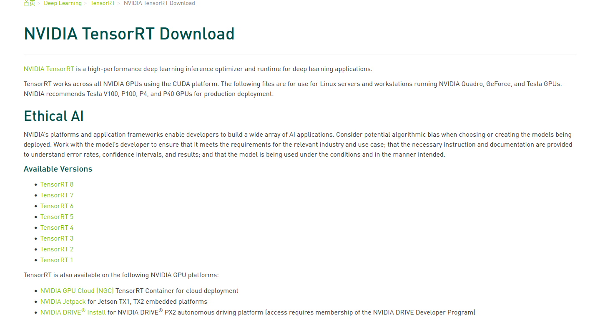

# Learning-MMDeploy
## 安装mmdeploy

下载mmdeploy  
```bash
git clone -b master git@github.com:open-mmlab/mmdeploy.git MMDeploy
cd MMDeploy
git submodule update --init --recursive
```
Build backend support
编译onnx


阖家团
  
